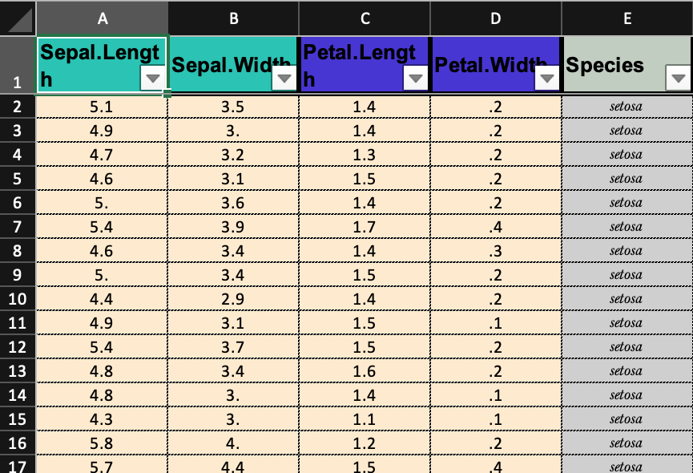
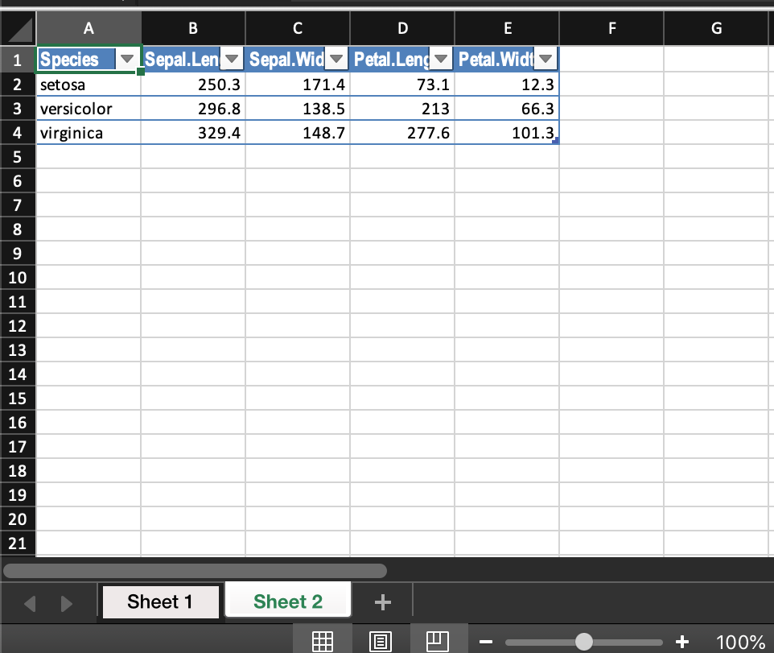

```{r setup, message=F, warning=F}
library(presenter)
library(dplyr)
```

# automatic formatting

Output is automatically formatted depending on the mode of the columns

# argument descriptions

## df

When using make excel, the first input is a dataframe, but do not input an expression or use a pipe. A variable name is necessary for proper naming of the excel output, which is sent to the working directory and named after the data frame. 

## last id col

The recommended ouput format is to put ID style columns first and and value columns after. Last_id_col takes the integer index of the last id column.

## header words

If value columns are organized by header words they can be included in a character string. This will color code the column headers. Split and merge cells are not used to maintain ease of read / write compatibility of the workbook with R. 


```{r eval=FALSE}
make_excel(df = iris, 
           header_word = c("Sepal", "Petal"),
           last_id_col = NULL)

```





## make simple excel

`make_simple_excel` allows the user to export to excel but with minimal formatting. THe data frame can be piped in, and unless specified otherwise in `output_file, the resulting excel file will be named after the data frame. 

```{r eval = FALSE}
iris %>% 
  make_simple_excel()
```


## export list of dfs

`make_simple_excel` also accepts a list of dfs, and exports one per sheet. This is useful when you automatically generated a list of tables, or saved a bunch of table summaries in a list. 

```{r eval=F}
iris %>% 
  group_by(Species) %>% 
  summarize(across(where(is.numeric), sum)) -> iris_summary

list(iris, iris_summary) -> iris_list

iris_list %>% 
  make_simple_excel()
```



## make an excel workbook with multiple sheets

Use the automated formatting paradigm and customize the id cols and header words for each sheet. 

```{r eval=F}
make_excel_wb(wb = NULL,
              object = iris,
              last_id_col = NULL,
              header_word = c("Sepal", "Petal")) %>% 
  make_excel_wb(object = anscombe,
                last_id_col = NULL,
                header_word = NULL) %>% 
  finish_excel_wb(wb_name = "data_workbook")
```


